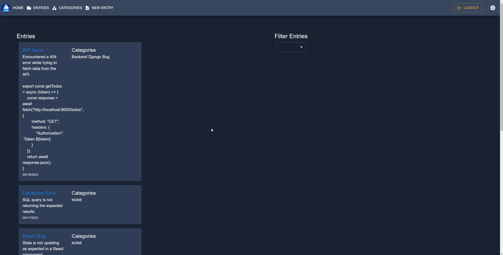
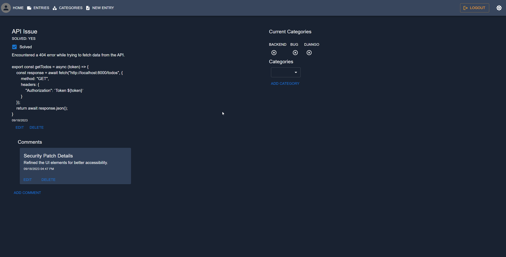

## Codessey: The Programmer's Daybook

## Application Overview
Codessey is a comprehensive full-stack platform designed to aid programmers in issue tracking. It offers functionalities for creating, viewing, and updating log entries, which users can comment on as they resolve coding challenges. Additionally, the platform provides the ability to create and modify categories for better organization of log entries. A built-in to-do list feature assists in managing short-term tasks, and a dark mode option ensures an eye-friendly interface for late-night coding stints.

## Technologies Used

  
   

 
## Getting Started
- Clone the repo and `cd` into the directory
- Start virtual environment: `pipenv shell`
- Install dependencies: `pipenv install -r requirements.txt`
- Start the server: `python manage.py runserver`

## Relevant Links

- [Deployed Application](https://codessey-bqw5g.ondigitalocean.app/)
    Login Credentials: username: demo password: test
- [Client side code](https://github.com/bhighlander/codessey-client)
- [ERD](https://dbdiagram.io/d/Codessey-64f76c3502bd1c4a5e04c718)
- [Wireframe](https://www.figma.com/file/PijgTcBzl4I5BG5jTpEHP0/Codessey?type=design&node-id=0-1&mode=design&t=bgQP6PN9EEtEuO7l-0)

## Screenshots

## Contributors
- [Brandon Highland](https://github.com/users/bhighlander)
